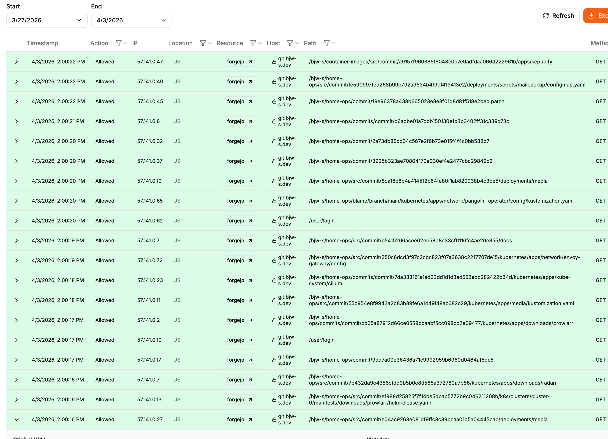

After recents issue with Github, i decided to host my own Forge server. This allowed me to at least be the only
responsible in case my git server goes down :oldmanyellatthecloud:. it was running fine, i moved everything on forgejo runner for my ci/cd with my own runner backend for kubernetes (will write about that). Everything was running smoothly, until it wasn't.

One day, Bernd (aka bjw-s), a fellow homelaber, creator of the mythic helm-template used by many, even OVH, told me his server was being spammed by requests. We're talking hundreds of hits per minute from AI crawlers, hammering the server hard enough to degrade performance and rack up bandwidth. Not ideal when you're running this on your own hardware at home.



The culprit became clear quickly. Looking at the Pangolin logs, we saw the same IP ranges hammering the server repeatedly. A quick lookup confirmed they all belonged to Meta's ASN. We then dug into the access logs to confirm — `meta-externalagent/1.1` all the way down.
Every single spike we observed came from meta-externalagent/1.1, Meta's AI crawler. And we're not alone — according to a Fastly report on 2025 AI crawler traffic, Meta accounts for 52% of all global AI crawler traffic [source 1](https://www.tecnoacquisti.com/en/blog/online-security-blog/meta-ai-bot-the-meta-webindexer-crawler-is-hammering-websites-with-thousands-of-requests-per-day) [source 2](https://usehall.com/agents/meta-externalagent).

The obvious first thought is: just block them in robots.txt. But hundreds of webmasters have reported that Meta's bot doesn't respect robots.txt directives and applies no rate limiting whatsoever.

So we had to go further.
Our first reaction was to use Anubis, it is a tool that sits before every requests and challenges anything that doesn't look legitimate , it is a great tool to protect against bots and scrapers.
We configured it to still allow legitimate traffic (API calls, git operations, Docker pulls) while challenging everything else:

```yaml title="anubis-config.yaml"
  - import: (data)/apps/gitea-rss-feeds.yaml
  - import: (data)/clients/git.yaml
  - import: (data)/clients/docker-client.yaml
  - name: allow-api
    path_regex: ^/api/.*
    action: ALLOW
  - import: (data)/meta/default-config.yaml
dnsbl: false
```

This helped significantly, and we could see Anubis blocking crawlers in the logs:

```json title="anubis.log"
{
  "time": "2026-04-03T20:57:19.271308391+02:00",
  "level": "INFO",
  "source": {
    "function": "github.com/TecharoHQ/anubis/lib.(*Server).checkRules",
    "file": "github.com/TecharoHQ/anubis/lib/anubis.go",
    "line": 307
  },
  "msg": "explicit deny",
  "subsystem": "anubis",
  "host": "git.erwanleboucher.dev",
  "method": "GET",
  "path": "/eleboucher/homelab/find/commit/9e060877607cb8db397570163708d0e73d0453fa",
  "user_agent": "meta-externalagent/1.1 (+https://developers.facebook.com/docs/sharing/webmasters/crawler)",
  "accept_language": "",
  "priority": "",
  "check_result": {
    "name": "bot/ai-catchall",
    "rule": "DENY",
    "weight": 0
  }
}
```

But it wasn't enough. The problem was architectural: Anubis was deployed inside my home cluster, meaning traffic still had to travel all the way to my home server before getting blocked. The bots were still hitting my home network on every request, which is far from ideal, both for bandwidth and exposure.
I needed to block things further upstream, at the VPS level, before they even reached my home.Therefore i decided to use a full nuclear solution and block most of ai scraper and ban any traffic from GAFAM(Google, Apple, Facebook, Amazon, Microsoft).

Since we already had CrowdSec running on our VPS alongside Pangolin [link of the article](/blog/pangolin). the fix was to push blocking logic there. First thing I noticed: the generated Docker Compose file from Pangolin had CrowdSec running in test mode — so it was doing absolutely nothing:

```yaml title="docker-compose.yml" "crowdsec (broken)"
container_name: crowdsec
```

Removing -t was step one. Then I added two CrowdSec scenarios.
The first one blocks known AI crawlers by user-agent. I made an exception for Claude (because i'm using it):

```yaml title="ban-ai-crawlers.yaml"
description: 'Ban AI crawlers and scrapers by user-agent'
filter: >-
  evt.Parsed.http_user_agent != nil
  && evt.Parsed.http_user_agent matches
  "(?i)(Meta-ExternalAgent|GPTBot|ClaudeBot|CCBot|Google-Extended|Bytespider|Amazonbot|anthropic-ai|Applebot-Extended)"
groupby: evt.Meta.source_ip
blackhole: 5m
labels:
  remediation: true
  type: ban
```

The second one goes further and blocks all traffic originating from GAFAM-owned networks, identified by their public ASNs (ASNs are unique numbers assigned to each network on the internet):

```yaml title="ban-gafam.yaml"
description: 'Ban traffic from GAFAM (Google, Apple, Facebook/Meta, Amazon, Microsoft) AS numbers'
filter: >-
  evt.Meta.ASNumber in [
    "15169", "396982",
    "714", "6185",
    "32934", "63293",
    "16509", "14618",
    "8075", "8068", "3598"
  ]
groupby: evt.Meta.source_ip
blackhole: 5m
labels:
  remediation: true
  type: ban
```

Both files go here:

```yaml title="ansible-task.yaml"
  target: /etc/crowdsec/scenarios/ban-gafam.yaml
- source: crowdsec_ban_ai_crawlers
  target: /etc/crowdsec/scenarios/ban-ai-crawlers.yaml
```

You can find the full commit here [link of the commit](https://git.erwanleboucher.dev/eleboucher/homelab/commit/7df9dea23377b8b1e185031a97148dc9317d7c3f)

The results were immediate. Within 24 hours, CrowdSec had banned hundreds of IPs, Anubis pressure dropped sharply. And everything was running smoothly again, ready to serve human traffic.
